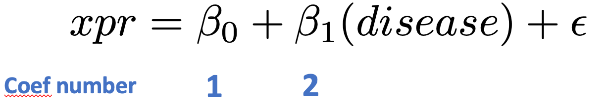

# Module 4: Finding differentially expressed genes from RNAseq data {-}

In this exercise, we will use `edgeR` to call differentially-expressed genes. For the example we will use an RNAseq dataset from a treatment-vehicle design. 

If you haven't already done so, install the `airway` dataset:

```{r, class.source="codeblock",eval=TRUE}
# BiocManager::install("airway") 
```
These data are from the paper:

Himes BE, Jiang X, Wagner P, Hu R, Wang Q, Klanderman B, Whitaker RM, Duan Q, Lasky-Su J, Nikolos C, Jester W, Johnson M, Panettieri R Jr, Tantisira KG, Weiss ST, Lu Q. “RNA-Seq Transcriptome Profiling Identifies CRISPLD2 as a Glucocorticoid Responsive Gene that Modulates Cytokine Function in Airway Smooth Muscle Cells.” PLoS One. 2014 Jun 13;9(6):e99625. PMID: [24926665](https://pubmed.ncbi.nlm.nih.gov/24926665/).

From the abstract of the original paper: 
 “Using RNA-Seq, a high-throughput sequencing method, we characterized transcriptomic changes in four primary human ASM cell lines that were treated with dexamethasone - a potent synthetic glucocorticoid (1 micromolar for 18 hours).”

Let's load the data
```{r,  class.source="codeblock",eval=TRUE}
suppressMessages(library(airway))
data(airway)
```

These data happen to be in a Bioconductor-specific format, so we use the special functions, `assay()` and `colData()` to get the expression data and sample information. 

```{r,  class.source="codeblock", eval=TRUE}
xpr <- assay(airway)
samples <- colData(airway)
```

**Questions:**  

* How many samples are in this experiment?
* How many genes were measured?
* How many treatment groups are there (`dex` column)?


Let's created a `DGEList` object (DGE stands for "Differential Gene Expression"). This object is what we will use for our differential expression analysis.

Note: Make phenotype of interest categorical. In R that means converting to a `factor` type with categorical `levels`. You can think of levels as ordinal representations (e.g., first level = 1, second = 2, etc., )

If `levels=` are not set, the default uses alphabetical order.  We recommend explicitly setting levels so that there are no assumptions.

Load the `edgeR` package:

```{r , class.source="codeblock",eval=TRUE}
suppressMessages(library(edgeR))
```

Let's create a `DGEList` object for the differential expression analysis.  Note that `group` must be a categorical variable (use `factor()` to convert it to one):

```{r dge-create, class.source="codeblock",eval=TRUE}
group <- factor(samples$dex)
dge <- DGEList(
    counts = xpr,
    group = group
    )
```

Remove low-count genes: To filter low count genes, we're going to use a normalized count measure called `cpm` (counts per million). We are going to keep genes with 100 or greater counts per million for at least two samples:

```{r dge-seecounts, class.source="codeblock",eval=TRUE}
head(dge$counts)
```

Look at counts per million using `cpm`:

```{r dge-cpm, class.source="codeblock",eval=TRUE}
cpm(dge)[1:5,1:5]
```
This next line is a bit complex so let's unpack it:

*  We are using `cpm(dge)>100` as a logical test ("which genes have cpm > 100?"). 
*  For each gene, we want that test to be true for at least two samples. For this we use `rowSums()` to add up how many samples meet that criteria. 
  
```{r dge-libsize, class.source="codeblock",eval=TRUE}
dim(dge) #before 

# keep genes which have cpm>100 in 2 or more samples
tokeep <- rowSums(cpm(dge)>100) >= 2 

# now filter for these
dge <- dge[tokeep,keep.lib.sizes = FALSE]

# how many genes do we have left?
dim(dge) #after
```

Normalize the data:
```{r dge-calcnorm, class.source="codeblock",eval=TRUE}
dge <- calcNormFactors(dge)
```

Visualize the data:
```{r, class.source="codeblock",eval=TRUE}
plotMDS(
    dge, 
    col=as.numeric(dge$samples$group), 
    pch=16
)
legend(
    "bottomleft", 
    as.character(unique(dge$samples$group)),
    col=c(1,2), pch=16
    )
```

Let's create a model design to identify genes with a `group` effect:

```{r dge-model, class.source="codeblock",eval=TRUE}
group <- dge$samples$group
mod <- model.matrix(~group)
```

Estimate variation ("dispersion") for each gene:
```{r dge-disp, class.source="codeblock",eval=TRUE}
dge <- estimateDisp(dge, mod)
```

Call differentially expressed genes. 

Here we:

* fit a model for each gene, using `glmFit`
* we have built in an estimate of gene-wise dispersion to better identify treatment effect (or "contrast")
* for each gene, we run a likelihood ratio test which compares which model fits the data better: a null model (treatment effect = 0)
 or a full model (treatment effect is non-zero)

Note that `coef=2` fetches the effects for the treatment effect; `coef=1` would fetch effects of the intercept term.<br>
&nbsp; <br>



```{r dge-diffex, class.source="codeblock",eval=TRUE}
fit <- glmFit(dge,mod)
diffEx <- glmLRT(fit, coef = 2) # get coefficients for group term
```

Look at the top 10 differentially expressed genes:
```{r dge-toptags, class.source="codeblock",eval=TRUE}
tt <- topTags(diffEx, n=10)
tt
```

For the next steps we're going to need stats on all the genes we've tested. So let's get those:
```{r, top-tags-full,class.source="codeblock",eval=TRUE}
tt <- as.data.frame(
    topTags(diffEx, n=nrow(dge)
    )
)
```

A QQplot directly compares the pvalues from our statistical tests to the expected values from a random uniform distribution (p-value selected at random).

A deviation from the x=y line (diagonal) towards the top indicates an enrichment of signal.

```{r, qqplot, class.source="codeblock",eval=TRUE}
qqplot(
    tt$PValue, 
    runif(nrow(tt)), # randomly sample from uniform distribution
    xlab="p-values from real data",
    ylab="Randomly-sampled values from Uniform distribution",
    pch=16,cex=0.5
)

# x=y line as reference
abline(0,1,col="red")
```

Now let's call differentially expressed genes using the `decideTestDGE()` function and use `summary()` to see how many genes are upregulated (value `+1`), downregulated (value `-1`) and not called as changed (value `0`)
```{r, decide-tests-dge, class.source="codeblock",eval=TRUE}
diffEx2 <- decideTestsDGE(diffEx, 
    adjust.method="BH", 
    p.value=0.05
)
summary(diffEx2)
```

### Volcano plot (R base graphics) {-}

A **volcano plot** can help visualize effect magnitude - log2 fold-change or `log2FC` in the table ` against the corresponding p-value. Here we create a volcano plot, and colour-code upregulated genes in red, and downregulated genes in blue.

Let's merge the data from `tt` and `diffEx2` (which has the up-/down-regulated status):

```{r, class.source="codeblock",eval=TRUE}
# needed to use merge function
diffEx2 <- as.data.frame(diffEx2) 
# give column more intuitive name
colnames(diffEx2)[1] <- "gene_status"

# add the common "gene" column to merge the two tables
diffEx2$gene <- rownames(diffEx2)
tt$gene <- rownames(tt)

mega <- merge(x = tt, y = diffEx2, by="gene")
```

Now we create a vector of colours, so that our upregulated genes are in red, downregulated genes are in blue, and not-significant genes are in black:

```{r, class.source="codeblock",eval=TRUE}
cols <- rep("black",nrow(tt))
cols[which(mega$gene_status > 0)] <- "red" # upregulated
cols[which(mega$gene_status < 0)] <- "blue" # downregulated
mega$cols <- cols

# volcano plot
plot(mega$logFC,
    -log10(mega$PValue),
    pch=16, 
    col=mega$cols,
    xlab="log(fold-change)",
    ylab="-log10(p-value)"
)
abline(v=0,lty=3)
```

### Volcano plot (ggplot2) {-}
Let's create a volcano plot using the `ggplot2` library.

For this let's add a NEW column indicating whether a gene is up-regulated, down-regulated, or n.s.

```{r,class.source="codeblock",eval=TRUE}
is_sig <- rep("n.s.", nrow(mega)) # default is ns
is_sig[which(mega$gene_status > 0)] <- "Upregulated"
is_sig[which(mega$gene_status < 0)] <- "Downregulated"

# use levels() to tell R how to order the categorical 
# variables. Downregulated = 1, n.s.=2, and Upregulated=3. 
# By default, R orders categorical variables alphabetically,
# which may not make sense!
mega$is_sig <- factor(is_sig, 
    levels = c("Downregulated","n.s.","Upregulated"))

```

Now let's create a volcano plot, colouring the dots by significance status. 

We will use `scale_color_manual()` from the `ggplot2` package to add a custom colour scheme. 

```{r,class.source="codeblock",eval=TRUE}
p1 <- ggplot(mega, 
    aes(x = logFC, y = -log10(FDR))) + # -log10 conversion  
    geom_point(aes(color=is_sig),size = 2/5) +  
    xlab(expression("log"[2]*"FC")) + 
    ylab(expression("-log"[10]*"FDR")) + 
    scale_color_manual(
        values = c("dodgerblue3", "gray50", "firebrick3")) 

p1
```


Finally we can write our differential expression results out to file:
```{r, class.source="codeblock",eval=TRUE}
write.table(mega,
    file="diffEx.results.txt",
    sep="\t",
    col=TRUE,
    row=TRUE,
    quote=FALSE
)
```

## Bonus Exercise {-}

* Install the `yeastRNASeq` package from Bioconductor and `library` it into your environment
* Import the geneLevelData using: `data("geneLevelData")`
* Learn about this data and then put it through the same workflow we just did for the breast cancer: 
1. Create a new `DGEList` object with your gene counts
2. Filter genes with CPM > 25 in at least two samples
3. Normalize and plot your data
4. Create a model matrix for analysis
5. Fit your model 
6. How many significantly up-regulated genes are there at the 5% FDR level? How many significantly down-regulated genes? How many in total
7. Create a volcano plot
8. Bonus: Create a histogram of p-values. Is there a signal?

Is there anything about the data that might make you question the results?
