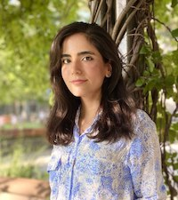

--- 
title: "Analysis Using R"
subtitle: "Canadian Bioinformatics Workshop"
author: "Instructors: Shraddha Pai, Chaitra Sarathy"
date: "last modified `r Sys.Date()`"
site: bookdown::bookdown_site
output: bookdown::gitbook
documentclass: book
bibliography: [book.bib]
biblio-style: nature
csl: nature.csl
link-citations: yes
github-repo: rstudio/bookdown-demo
favicon: images/favicon.ico
description: "Principles of exploratory data analysis, RNAseq differential expression, and generalized linear models"
---

# Welcome {-}
Welcome to [Analysis Using R](https://bioinformatics.ca/workshops-all/2024-analysis-using-r/) 2024.

## Meet your Faculty {-}

### Shraddha Pai {.unlisted .unnumbered}
Investigator I, OICR<br>
Assistant Professor, University of Toronto


Dr. Pai integrates genomics and computational methods to advance precision medicine. Her previous work involves DNA methylome-based biomarker discovery in psychosis, and building machine learning algorithms for patient classification from multi-modal data. The <a href="https://pailab.oicr.on.ca">Pai Lab at the Ontario Institute for Cancer Research</a> focuses on biomarker discovery for detection, diagnosis and prognosis in brain cancers and other brain-related disorders. 

### Chaitra Sarathy {.unlisted .unnumbered}
Scientific Associate <br>
Princess Margaret Cancer Centre<br>
University Health Network


Dr. Sarathy is a computational biologist with experience in software development. During her PhD, she applied mathematical modelling, network analysis and multi-omics integration to study complex diseases. She has contributed to open-source toolboxes (openCOBRA) and developed softwares (EFMviz & ComMet) to analyse genome-scale metabolic models. She currently works in the Bader lab’s MODiL team (Multi Omics Data Integration and Analysis) and with groups at PMCC, where she develops pipelines to analyse various omics data types and discover new drug targets in cancer.

### Delaram Pouyabahar {.unlisted .unnumbered}
PhD Candidate <br>
University of Toronto, Donnelly Centre <br>


Delaram is a Ph.D. candidate in Computational Biology at the Molecular Genetics department at UofT. She completed her undergraduate studies at the University of Tehran before joining the Bader lab in Toronto. Her research centers around the development of computational tools to explore sources of variation in single-cell transcriptomics maps, with a particular emphasis on liver biology and transplantation.


### Ian Cheong {.unlisted .unnumbered}

MSc. Candidate<br>
University of Toronto


Ian is a Master's level candidate in the Department of Medical Biophysics at the University of Toronto. His thesis work in the Pai lab involves analysis of single-cell transcriptomes to find the link between brain development and the development of childhood brain cancer. 
&nbsp;&nbsp;<br>
&nbsp;&nbsp;<br>

### Nia Hughes {.unlisted .unnumbered}


Program Manager<br>
Bioinformatics.ca<br>
<a href="mailto:nia.hughes@oicr.on.ca">nia.hughes@oicr.on.ca</a>


Nia is the Program Manager for Bioinformatics.ca, where she coordinates the Canadian Bioinformatics Workshop Series. Prior to starting at the OICR, she completed her M.Sc in Bioinformatics from the University of Guelph in 2020 before working there as a bioinformatician studying epigenetic and transcriptomic patterns across maize varieties.

<p></p>

## Pre-workshop Materials and Laptop Setup Instructions {-}

### Laptop Setup Instructions {-}

A checklist to setup your laptop can be found here. 

Install these tools on your laptop before coming to the workshop:

1. R (4.0+)
<i>Note:</i> MacBook users with an Apple silicon chip (e.g., M1 or M2) should install the "arm64" version of R, while MacBook users with an Intel chip should install the regular (64-bit) version of R. You can check your laptop's hardware specifications by clicking the Apple icon (top left corner) > About This Mac and verifying whether the chip is Apple or Intel.
2. Rstudio
3.  Make sure you have a robust internet browser such as Firefox, Safari or Chrome (not Internet Explorer).
4.  Make sure you have a PDF viewer (e.g. Adobe Acrobat, Preview or similar) or that you can read PDF files in your Web browser.

### R packages {-}

```{r install-packages, eval=TRUE}
pkgList <- c("tidyverse", "clValid","rgl","RColorBrewer","corrplot","ClusterR",
  "Rtsne","umap","BiocManager","mlbench","plotrix", "factoextra")
for (cur in pkgList){
  message(sprintf("\tChecking for %s ...", cur))
  if (!requireNamespace(cur, quietly = TRUE)) install.packages(cur)
}
if (!requireNamespace("edgeR", quietly = TRUE)) BiocManager::install("edgeR")
if (!requireNamespace("curatedTCGAData", quietly = TRUE)) BiocManager::install("curatedTCGAData")
```

We are going to use `titanic.csv` in Module 3.
Download [the dataset here](https://drive.google.com/file/d/1PdP7bZTbmcRrPPPYFf1Mr8vfucom-d4k/view?usp=sharing) and copy it into your working directory.

# Lecture slides {-}

* [Module 1: Exploratory Data Analysis and Clustering](https://github.com/RealPaiLab/CBW_AUR2023/blob/main/book/lectures/AUR_2023_Module1_EDA.pdf)
* [Module 2: Dimensionality reduction for visualization and analysis](https://github.com/RealPaiLab/CBW_AUR2023/blob/main/book/lectures/AUR_2023_Module2_DimensionReduction.pdf)
* [Module 3: Generalized linear models](https://github.com/RealPaiLab/CBW_AUR2023/blob/main/book/lectures/AUR_2023_Module3_GLM.pdf)
* [Module 4: Multiple hypothesis testing with RNA-seq differential expression analysis](https://github.com/RealPaiLab/CBW_AUR2023/blob/main/book/lectures/AUR_2023_Module4_RNAseq.pdf)

