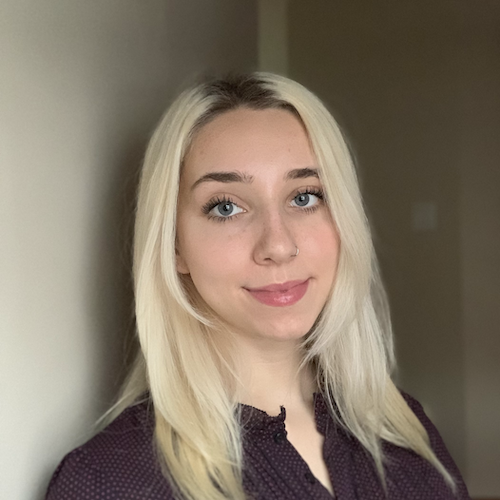
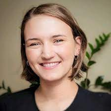

--- 
title: "Analysis Using R"
subtitle: "Canadian Bioinformatics Workshop"
author: "Instructors: Shraddha Pai, Chaitra Sarathy"
date: "last modified `r Sys.Date()`"
site: bookdown::bookdown_site
output: bookdown::gitbook
documentclass: book
bibliography: [book.bib]
biblio-style: nature
csl: nature.csl
link-citations: yes
github-repo: rstudio/bookdown-demo
favicon: images/favicon.ico
description: "Principles of exploratory data analysis, RNAseq differential expression, and generalized linear models"
---

# Welcome {-}
Welcome to [Analysis Using R](https://bioinformatics.ca/workshops-all/2024-analysis-using-r/) 2024.

## Meet your Faculty {-}

### Shraddha Pai {.unlisted .unnumbered}
Investigator I, OICR<br>
Assistant Professor, University of Toronto


Dr. Pai integrates genomics and computational methods to advance precision medicine. Her previous work involves DNA methylome-based biomarker discovery in psychosis, and building machine learning algorithms for patient classification from multi-modal data. The <a href="https://www.shraddhapailab.com/">Pai Lab at the Ontario Institute for Cancer Research</a> focuses on biomarker discovery for detection, diagnosis and prognosis in brain cancers and other brain-related disorders. 

### Chaitra Sarathy {.unlisted .unnumbered}
Bioinformatics Specialist <br>
Krembil Research Institute<br>


Dr. Sarathy is a computational biologist with industry experience in software development. 
Her previous research centered around developing multi-scale mathematical models of human systems to characterise biochemical changes in obesity. In addition, she has developed methods based on machine learning and multi-omics integration to identify drug targets in cancer and stratify patients for clinical trials. She currently focusses on characterising genetic malfunctions in neurological diseases.

### Ian Cheong {.unlisted .unnumbered}

MSc. Candidate<br>
University of Toronto

Ian is a Master's level candidate in the Department of Medical Biophysics at the University of Toronto. His thesis work in the Pai lab involves analysis of single-cell transcriptomes to find the link between brain development and the development of childhood brain cancer. 
&nbsp;&nbsp;<br>
&nbsp;&nbsp;<br>

### Zoe Klein {.unlisted .unnumbered}

PhD. Candidate<br>
University of Toronto

Zoe is a PhD level candidate in the Department of Molecular Genetics at the University of Toronto. Her thesis work in the Reimand lab involves using computational tools to investigate the role of non-coding RNA in cancer. 
&nbsp;&nbsp;<br>
&nbsp;&nbsp;<br>


### Amin Nooranikhojasteh {.unlisted .unnumbered}

### Nia Hughes {.unlisted .unnumbered}


Program Manager<br>
Bioinformatics.ca<br>
<a href="mailto:nia.hughes@oicr.on.ca">nia.hughes@oicr.on.ca</a>


Nia is the Program Manager for Bioinformatics.ca, where she coordinates the Canadian Bioinformatics Workshop Series. Prior to starting at the OICR, she completed her M.Sc in Bioinformatics from the University of Guelph in 2020 before working there as a bioinformatician studying epigenetic and transcriptomic patterns across maize varieties.

<p></p>

## Pre-workshop Materials and Laptop Setup Instructions {-}

### Laptop Setup Instructions {-}

A checklist to setup your laptop can be found here. 

Install these tools on your laptop before coming to the workshop:

1. R (4.0+)
<i>Note:</i> MacBook users with an Apple silicon chip (e.g., M1 or M2) should install the "arm64" version of R, while MacBook users with an Intel chip should install the regular (64-bit) version of R. You can check your laptop's hardware specifications by clicking the Apple icon (top left corner) > About This Mac and verifying whether the chip is Apple or Intel.
2. Rstudio
3.  Make sure you have a robust internet browser such as Firefox, Safari or Chrome (not Internet Explorer).
4.  Make sure you have a PDF viewer (e.g. Adobe Acrobat, Preview or similar) or that you can read PDF files in your Web browser.

### R packages {-}

```{r install-packages, eval=TRUE}
pkgList <- c("tidyverse", "clValid","rgl","RColorBrewer","corrplot","ClusterR",
  "Rtsne","umap","BiocManager","mlbench","plotrix", "factoextra")
for (cur in pkgList){
  message(sprintf("\tChecking for %s ...", cur))
  if (!requireNamespace(cur, quietly = TRUE)) install.packages(cur)
}

biocPkg <- c("edgeR","bladderbatch","airway")
for (cur in biocPkg){
  if (!requireNamespace(cur, quietly = TRUE)) BiocManager::install(cur)
}
```

### Download example data {-}

1. Download data for the workshop: [AUR2024_data.zip](https://drive.google.com/file/d/1DUSqDM1DGQaqPOk1iL8JxfU0TgCr-4MR/view?usp=sharing).
2. Move the zip file to your working directory (usually under "/Users/yourname"). 
3. Unzip the file. You should see a folder with 4 files in it.

# Lecture slides {-}

* [Module 1: Exploratory Data Analysis and Clustering](https://github.com/RealPaiLab/CBW_AUR2023/blob/main/book/lectures/AUR_2023_Module1_EDA.pdf)
* [Module 2: Dimensionality reduction for visualization and analysis](https://github.com/RealPaiLab/CBW_AUR2023/blob/main/book/lectures/AUR_2023_Module2_DimensionReduction.pdf)
* [Module 3: Generalized linear models](https://github.com/RealPaiLab/CBW_AUR2023/blob/main/book/lectures/AUR_2023_Module3_GLM.pdf)
* [Module 4: Multiple hypothesis testing with RNA-seq differential expression analysis](https://github.com/RealPaiLab/CBW_AUR2023/blob/main/book/lectures/AUR_2023_Module4_RNAseq.pdf)

